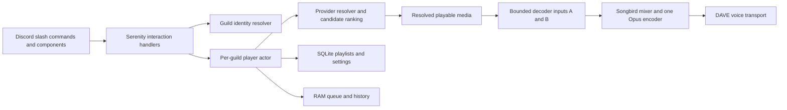

# Proposed architecture

Status: design, pending stack confirmation; paths below are planned, not implemented.



## Responsibilities and concurrency

Interaction handlers defer slow replies promptly, validate guild and voice-channel access, and send typed requests to a bounded guild actor. The actor owns queue ordering, current/outgoing/incoming tracks, settings, history, and a monotonically increasing playback generation. A global admission controller limits active guilds and decoder/extractor jobs.

Network requests and process IO run asynchronously. Blocking database or decoder work uses the driver's audio workers or a bounded blocking pool. Never hold the guild-state lock across network work, process startup, or Discord replies. Resolver results carry a generation identifier; results from an interrupted /play or /stop must not restart playback.

The audio callback performs only mixing/encoding and short control operations. No provider search, database write, or Discord request belongs in it. Songbird separates asynchronous connection management from synchronous audio work. [Driver implementation](https://raw.githubusercontent.com/serenity-rs/songbird/current/src/driver/mod.rs).

## Dynamic identity

At initialization, fetch the current application and cache its application name. This is deliberately the Developer Portal application name, which may differ from the bot user's username. For a guild, fetch the bot's own member and use a non-empty nickname when present; otherwise use the cached application name. Refresh guild identity on joining a guild and entering voice, and use a short TTL for later displays. Refresh relevant member updates when available. A failed member refresh can use the last known identity; it must not invent a nickname or silently change the configured global fallback.

Use the same resolver for response titles, now-playing messages and help. Reject DMs for guild music controls. Application identity comes from the [current application resource](https://docs.discord.com/developers/resources/application); guild nickname comes from the [guild member resource](https://docs.discord.com/developers/resources/guild#guild-member-object).

## Playback and queue rules

- /play defaults to appending; Next inserts the whole requested batch at the head while preserving its order; Now cancels both crossfade sources and replaces playback immediately. Playlist shuffle happens before inserting the batch.
- Resolve playlist entries lazily under a queue limit; avoid starting one subprocess per playlist item.
- /stop cancels resolving, preloading, transitions, and both inputs, then clears the queue. /disconnect also tears down voice.
- /pause freezes both tracks and the transition clock; /skip during a transition promotes the incoming track once. Queue mutation must invalidate stale preloads.
- /seek uses playback-relative time, invalidates transitions, and restarts/repositions only supported finite sources. Live sources return a clear unsupported response.
- Button/select interactions are scoped to guild, player generation, requester where needed, and an expiry. Apply DJ/voice membership checks again when a component is used.

Only saved playlists/settings need durable storage. Runtime queue/history live in RAM unless a later settings choice explicitly adds persistence. Save user-requested durable edits before acknowledging success; do not write playback position every second.

## Planned source layout

```text
src/
  main.rs                 startup, shutdown, Discord client
  config.rs               validated environment and limits
  discord/
    identity.rs           application and guild identity
    commands/             slash commands grouped by module
    components.rs         buttons, modals, search selections
  music/
    actor.rs              serialized guild player operations
    queue.rs              queue, repeat, shuffle and history
    resolve.rs            ranked query and URL resolution
    providers/            explicit capability adapters
    audio.rs              input lifetime and Songbird driver
    crossfade.rs          two-track transition state machine
  storage/                SQLite schema and repositories
tests/                    queue, resolution and audio behavior
deploy/                   image build and runtime checks
```

## Initial resource limits

These are proposed admission limits, not benchmark results:

| Resource | Initial limit |
| --- | --- |
| Active guild players | 1; consider 2 only after target-board measurements |
| Decoder inputs | 2 total, including muted/preloaded tracks |
| Extractor jobs | 1 total; requests wait in a bounded queue |
| Metadata candidates | At most 10 per query |
| Track queue | At most 200 entries per guild |
| Audio buffers | At most 10 seconds per input, bounded by bytes |
| Bot cgroup memory | 1536 MiB, including tmpfs use |
| tmpfs capacity | 96 MiB temporary/cache + 16 MiB logs + 8 MiB runtime |
| CPU quota | 3 cores, with audio-thread latency measured |

Stereo PCM at 48 kHz uses 192,000 bytes/second for 16-bit samples or 384,000 for float32. Two 10-second float32 buffers need about 7.32 MiB, excluding decoder, transport and allocator overhead. Large file caches are unnecessary for streaming. Measure process RSS, cgroup memory, audio underruns, CPU and temperature during repeated 10-second overlaps before increasing concurrency.
