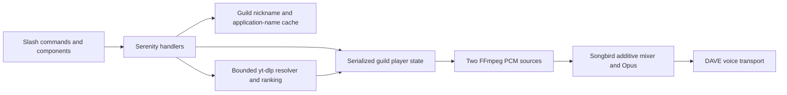

# Implementation architecture

Status: foundational code after owner stack confirmation. Remaining modules are listed in the roadmap.

`discord.rs` registers guild/global commands, defers slow replies, enforces same-voice-channel controls and owns at most one connected guild. Search selections are requester/guild/generation-bound, expire after two minutes and are capped at 64. Buttons recheck the user's voice channel. These initial controls have no DJ-role policy yet. Responses disable mentions from provider metadata.

`resolver.rs` serializes extraction, admits at most eight searches, caps metadata at 2 MiB and limits each subprocess to 45 seconds. Public playlists expand only their first 200 entries. Stderr is drained without retaining URLs or headers. Cancellation drops and kills the extractor. Search considers ten candidates and offers up to five choices. Signed stream URLs refresh just before decoder startup and are never persisted.

`player.rs` serializes queue/control changes under one mutex. Its 20 ms worker uses bounded driver-state reads; provider I/O and input parsing run separately. A playback generation invalidates old searches/selections after stop, skip, disconnect or an accepted Now request. Next restores an unused preload ahead of the old queue before inserting the new batch. Stop clears both active sources and reserved preparations; skip during overlap promotes the incoming source once. Disconnect clears the allocation; voice moves update the control channel.

A global semaphore caps live FFmpeg decoders at two, including prepared inputs. Its permit is retained through process kill/reap. Decoder output is 48 kHz stereo float32 over a pipe, wrapped in Songbird's RawAdapter. Songbird parses/decodes on its worker threads and mixes two additive tracks into the shared Opus output. No whole-file media cache is used. Crossfade clock and gains use actual incoming play time, with 0.5 output headroom and Songbird soft clipping. A bounded 500-frame PCM channel caps buffering at ten seconds per source (3.84 MB plus working frames). Initial preparation waits for 0.5 seconds of PCM or a short source ending; blocking pipe reads run on separate workers. Network stalls beyond available buffering can still interrupt audio and require live failure testing.

`model.rs` owns tested queue insertion, ranking and transition gain policy. `main.rs` checks tools, fetches the Developer Portal application name, starts gateway/voice integration, writes a readiness heartbeat and handles termination. Guild nickname lookups use a five-minute cache, capped at 128 entries; failed lookups use the application name.

Initial enforced limits: one connected guild, two decoders, one extractor, eight resolving searches, 200 queued tracks. The container has a 1536 MiB memory/swap-equality limit and three CPU quota cores. These are admission/deployment caps, not target-device benchmark results.

SQLite, durable playlists/settings, history and the remaining commands are not implemented. Only RAM state exists, so restarts clear playback and settings. The original [audio design](audio-engine.md) retains later acceptance gates and per-sample ramp alternatives.
