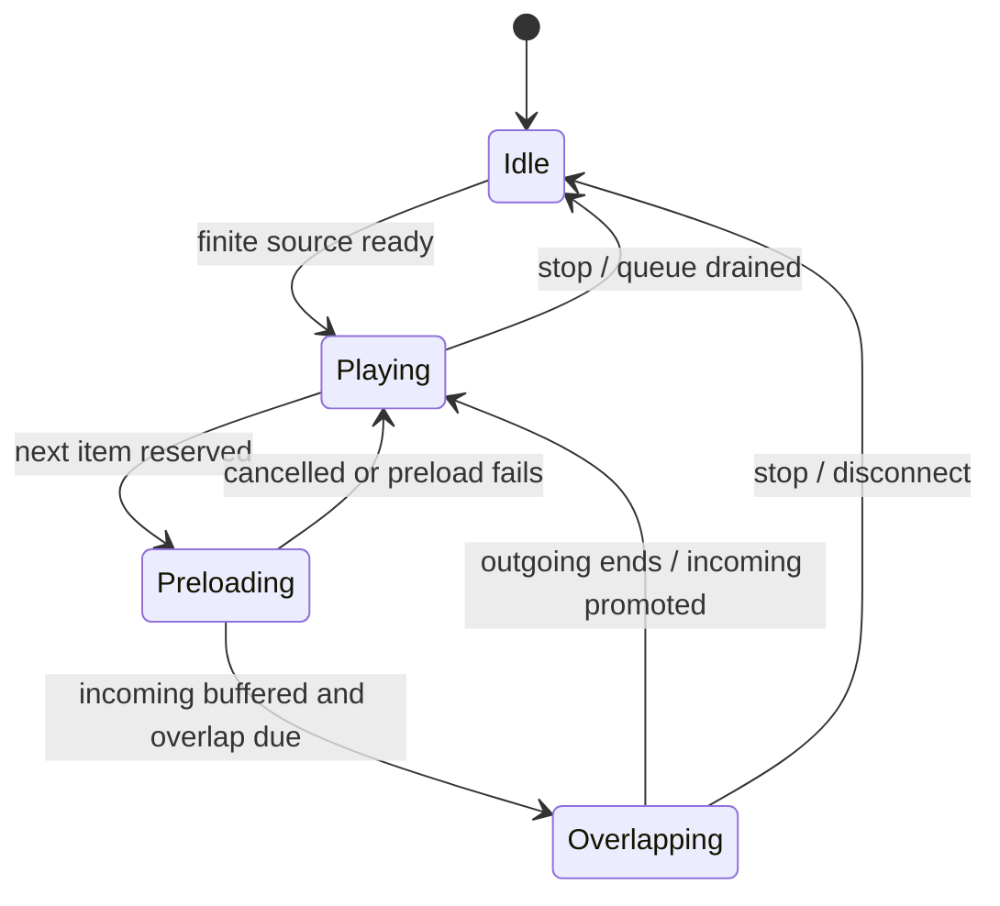

# Audio engine design and validation gates

## Engine selection

Use Songbird's native multi-track driver. Its non-exclusive play operation adds a source while preserving other inputs; the exclusive play operation replaces them. Use the additive path for transitions and an application-owned queue rather than relying on a sequential queue to produce crossfading. This is supported overlapping playback, with the initial transition policy implemented in src/player.rs. [Songbird driver source](https://raw.githubusercontent.com/serenity-rs/songbird/current/src/driver/mod.rs).

Decode each source to a compatible common sample rate/channel layout, blend inside one guild driver, then encode the mixed output once. Keep Opus passthrough disabled during mixing/effects. The current adapter uses FFmpeg PCM pipes for all playable sources and ten-second bounded PCM channels into Songbird/Symphonia. No complete track is written to disk.

FFmpeg's acrossfade filter provides a useful reference for validating finite two-input transitions and has an explicit overlap option. A static two-URL filter graph alone is not the proposed mutable Discord queue engine. [FFmpeg acrossfade documentation](https://www.ffmpeg.org/ffmpeg-filters.html#acrossfade).

## Transition mechanics

The /crossfade command stores enabled/disabled, a 3–10 second duration, and a curve. The implementation defaults to 5 seconds and a linear curve; crossfade is disabled by default until validation.

For normalized progress t from 0 to 1:

- Linear: outgoing gain = 1 - t; incoming gain = t.
- Equal-power: outgoing gain = cos(pi t / 2); incoming gain = sin(pi t / 2).

Reserve headroom for equal-power mixing: correlated, loud sources can exceed full scale even though their individual gains are below one. Start with conservative output gain and validate a limiter before allowing volume above unity. Report the actual track timing in now-playing during a transition.

The controller reserves the next queue item and resolves its stream close enough to use that expiring URL. Start incoming playback at zero gain only when it is ready, overlap both sources for the chosen duration, then stop/release the outgoing handle and promote the incoming track. At most two decoded sources exist at once.

Drive progress from consumed media time, not elapsed wall time: pausing and buffering must not finish the fade in the background. Track-handle volume ramps at audio-frame cadence provide the initial controller mechanism; these are discrete gain updates, not a claim of sample-accurate automation. Validation must listen for clicks/steps and verify envelopes. If frame ramps fail that gate, interpolate gain in a PCM envelope input before release. No bare fade-out followed by fade-in qualifies as crossfade.

Use known finite duration to schedule the transition. Do not promise automatic end-of-track crossfades for live streams or unknown duration. If duration is unreliable, incoming media is late, or decoding fails, finish the outgoing track and use ordinary advancement; never discard a song's ending simply to claim a transition occurred.

Every state-changing operation increments the playback generation and cancels old preloads/timers. Tests must cover stop/skip/seek, changed queue head, a failed incoming decoder, shorter-than-transition tracks, and pause/resume during overlap. After promotion the new track's clock includes audio already heard in the fade; replay/history must not record it twice.

## Validation required before feature completion

1. Feed distinguishable generated tones into the two inputs; record mixed PCM and prove both frequencies exist during the overlap and only the intended source exists on each side.
2. Verify linear/equal-power gain envelopes, output duration, clipping behavior and 3/5/10 second settings. Check full-scale and correlated audio.
3. Exercise cancellation and queue mutations without leaked tasks, orphan child processes, or double advancement.
4. Run DAVE voice playback/reconnect in a test guild and capture underrun behavior separately from mixer correctness.
5. Measure sustained ARM64 playback and repeated overlap on the Orange Pi before raising player capacity.

These remain live-voice/device acceptance gates. Unit tests exercise simultaneous input signals and gain policy; no recorded outbound Discord audio or device benchmark has been run.
