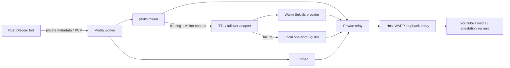

# PO tokens, VisitorData and WARP

Keep Rust/Serenity/Songbird and yt-dlp. A maintained BgUtils provider reduces the
attestation code we must audit and tracks YouTube changes upstream. A warm Node
service avoids launching a browser per track. Its one-shot local script recovers
from service crashes, timeouts and invalid responses, but shares the attestation
library: it cannot guarantee recovery from YouTube protocol changes.

The [yt-dlp guide](https://github.com/yt-dlp/yt-dlp/wiki/PO-Token-Guide) recommends
`mweb` with a provider plugin. yt-dlp discovers VisitorData during proxied session
bootstrap and passes the matching InnerTube context and content binding. Binding
may be a visitor session or video ID. Never invent VisitorData or substitute a
video ID for it. Metadata requests that need no token avoid generation; the plugin
fetches tokens before requests that require them.

## Flow and complete code



- `media/tokens.py`: checks bindings/expiry, caps cache at 256, serializes generation,
  and keys it by binding, context, proxy and egress epoch. Entries need more than
  one hour plus five minutes remaining; fresh requests bypass upstream caches.
  Primary timeout is five seconds; local fallback is twelve seconds. Failures open
  a 60-second circuit. Both failing returns an error, never a stale token.
- `media/worker.py`: signed URLs and visitor context remain in the worker. The bot
  gets sanitized metadata or a single-use PCM ticket expiring in 90 seconds.
  Extraction/decoder errors get one retry with fresh tokens and local fallback.
  Long playback reauthorizes hourly by wall time or delivered audio. Finite tracks
  reopen at the delivered offset; live streams reconnect at the live edge. Gaps
  are possible. Provider expiry is an estimate; YouTube can revoke tokens early.
- `media/entrypoint.sh`: installs IPv4/IPv6 nftables rules in the worker namespace
  before application startup, then switches to UID 10001 and drops all capabilities.
  Outbound connections allow only loopback, established replies and the private
  relay's IP/port. Direct Internet, DNS and other host ports are denied. Redirects
  and WebSockets must use that same allowed proxy path or fail.
- `media/bridge.py`: binds only the Docker gateway, accepts only the worker's IP,
  and forwards to the fixed WARP loopback listener. It has no public port mapping.
- `media/client.py`: bot-side IPC rejects external destinations and redirects.
  The bot has no yt-dlp, provider or FFmpeg binaries and no direct media fallback.

The worker checks proxied Cloudflare trace for `warp=on`/`plus` before work, caches
the check for 30 seconds and invalidates tokens on observed egress changes. It
trusts the installed WARP client's tunnel implementation. This is not anonymity:
Cloudflare and Discord can still see the server IP. Shared WARP IPs can be blocked;
no free option guarantees speed, uptime or stable egress. Start with WARP's default
transport and benchmark locally. A VPN with dedicated stable egress can be more
predictable but costs money. All supported media providers use protected egress;
Discord Gateway and voice traffic retain ordinary host networking.

## Host installation: Debian 12/13, ARM64 or AMD64

Use a Cloudflare-supported OS; arbitrary DietPi releases are not automatically
supported. Run these on the server, outside containers. Host networking has not
been changed by this implementation.

```sh
sudo apt-get update
sudo apt-get install -y curl gnupg lsb-release
curl -fsSL https://pkg.cloudflareclient.com/pubkey.gpg | \
  sudo gpg --yes --dearmor -o /usr/share/keyrings/cloudflare-warp-archive-keyring.gpg
echo "deb [signed-by=/usr/share/keyrings/cloudflare-warp-archive-keyring.gpg] https://pkg.cloudflareclient.com/ $(lsb_release -cs) main" | \
  sudo tee /etc/apt/sources.list.d/cloudflare-client.list
sudo apt-get update
sudo apt-get install -y cloudflare-warp
warp-cli registration new
warp-cli mode proxy
warp-cli proxy port 40000
warp-cli connect
warp-cli status
curl --fail --proxy socks5h://127.0.0.1:40000 https://www.cloudflare.com/cdn-cgi/trace
curl --fail --proxy http://127.0.0.1:40000 https://www.cloudflare.com/cdn-cgi/trace
```

Require `warp=on` or `warp=plus` from both checks. Skip registration if already
registered; accept Cloudflare's terms when prompted. If your release differs,
check `warp-cli proxy --help`. Keep proxy mode to avoid routing Discord voice
through WARP unnecessarily. Official references:
[package repository](https://pkg.cloudflareclient.com/),
[Linux setup](https://developers.cloudflare.com/warp-client/get-started/linux/),
[proxy mode](https://developers.cloudflare.com/warp-client/warp-modes/).

## Start and monitor

Check `ip route` and Docker networks for overlap with `172.30.90.0/24`. If necessary,
change the Compose gateway, worker, bot and endpoint addresses together. Deployment
requires Linux host networking for the relay; Docker Desktop is not the target.

```sh
cp .env.example .env
# Edit .env locally: Discord token and development guild ID.
docker compose config --quiet
docker compose up --build -d
docker compose ps
docker compose exec media tail -n 50 /var/log/sol/media.log
```

The bot waits for media/WARP health. Only the firewall bootstrap receives NET_ADMIN,
SETUID, SETGID and SETPCAP, inside its private namespace. Application processes drop
all capabilities. Never grant these to the bot or use `--privileged`. All runtime
logs/caches use bounded tmpfs. Events include `token_primary_failed`,
`token_fallback_started`, `token_fallback_success`, `token_refreshed`,
`stream_retry_fresh_tokens`, `stream_lease_refresh` and `warp_unavailable`. They
record exception types/status codes/timings, never tokens, visitor context or URLs.

Memory ceilings are 1536 MiB bot + 768 MiB media + 64 MiB relay, plus host WARP/OS.
Measure peak usage on the 4 GiB Orange Pi; these are ceilings, not benchmarks.
Configure host swap/log retention if the original RAM-only runtime target applies;
WARP host registration state and OS package installation are persistent host writes.
Actual WARP egress, Discord audio, long-stream renewal and target-device throughput
remain deployment checks.

## Validation and dependencies

```sh
python3 -m unittest discover -s tests -p test_media.py -v
cargo fmt --all --check
cargo test --locked
cargo clippy --locked --all-targets -- -D warnings
```

CI builds ARM64 images, imports the plugin against pinned yt-dlp and checks the
actual firewall with a local proxy fixture, including proxy failure. No Discord
credential or YouTube access is required. BgUtils 2.0.1 is pinned to commit
`2df09aeaa71a4eec1e31901e84fbddbf0c7c54a9`, with a checked archive SHA256 and npm
lockfile. Python direct dependencies have exact versions. Base image tags and
transitive Python packages remain mutable; digest/hash pinning is a release
hardening step. Review dependency updates rather than auto-updating production.
